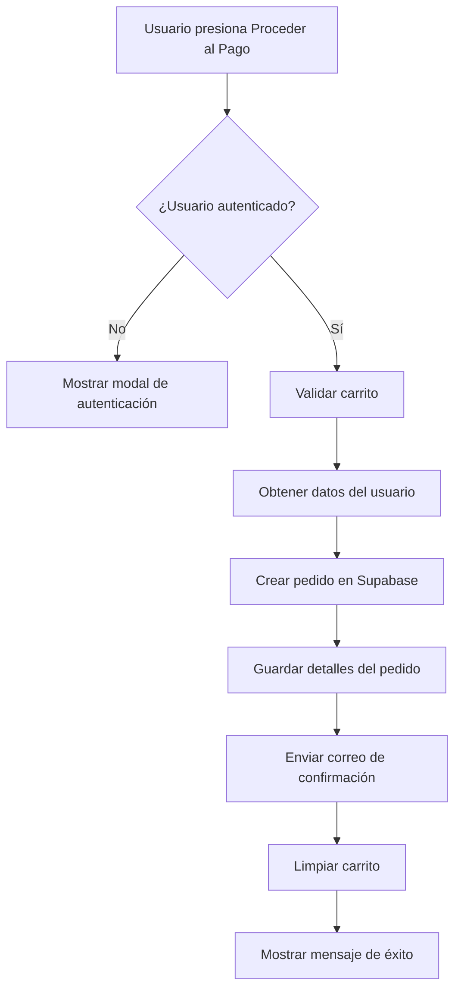

# Sistema de Envío de Correos para Pedidos

## Descripción
Este sistema permite enviar correos electrónicos de confirmación a los clientes cuando realizan un pedido en la plataforma.

## Componentes Implementados

### 1. API Route de Resend
**Archivo:** `app/api/send-order-email/route.ts`

Esta ruta API se encarga de enviar correos electrónicos usando el servicio Resend. Recibe la información del pedido y envía un correo formateado al cliente.

**Endpoint:** `POST /api/send-order-email`

**Parámetros esperados:**
```json
{
  "userEmail": "cliente@example.com",
  "userName": "Juan Pérez",
  "orderId": 123,
  "orderDate": "2024-01-01T12:00:00",
  "totalAmount": 150000,
  "items": [
    {
      "nombre": "Producto 1",
      "descripcion": "Descripción del producto",
      "quantity": 2,
      "unitPrice": 75000
    }
  ],
  "orderStatus": "pendiente"
}
```

### 2. Integración en el Carrito
**Archivo:** `app/carrito/page.tsx`

La función `handlePayment()` ahora:
1. Guarda el pedido en Supabase (tabla `pedidos`)
2. Guarda los detalles del pedido (tabla `detalle_pedido`)
3. Envía un correo de confirmación al cliente usando la API de Resend
4. Limpia el carrito
5. Muestra un mensaje de éxito al usuario

## Flujo de Proceso



## Configuración de Resend

### API Key Actual
La API key de Resend está actualmente hardcodeada en `app/api/send-order-email/route.ts`:
```typescript
const resend = new Resend('re_GJUqDTzA_7ebg7BLvry5HDYpsB4bfNCSg')
```

### Recomendación para Producción
Para mayor seguridad, se recomienda mover la API key a variables de entorno:

1. Crear archivo `.env.local`:
```env
RESEND_API_KEY=re_GJUqDTzA_7ebg7BLvry5HDYpsB4bfNCSg
```

2. Actualizar el código en `app/api/send-order-email/route.ts`:
```typescript
const resend = new Resend(process.env.RESEND_API_KEY)
```

## Contenido del Correo

El correo incluye:
- ✅ Saludo personalizado con el nombre del cliente
- ✅ Número de pedido
- ✅ Fecha y hora del pedido
- ✅ Estado del pedido (pendiente)
- ✅ Tabla detallada con los productos:
  - Nombre del producto
  - Descripción
  - Cantidad
  - Precio unitario
  - Subtotal
- ✅ Total del pedido (destacado)
- ✅ Instrucciones de pago
- ✅ Información de contacto
- ✅ Diseño responsive y profesional

## Remitente del Correo

**De:** `onboarding@resend.dev`

**Nota:** Este es el remitente predeterminado de Resend para cuentas de desarrollo. Para producción, se debe verificar un dominio propio en Resend y actualizar el campo `from` en la API route.

### Cómo cambiar el remitente:

1. Verificar tu dominio en Resend: https://resend.com/domains
2. Actualizar el código:
```typescript
const data = await resend.emails.send({
  from: 'pedidos@tudominio.com', // Cambiar aquí
  to: userEmail,
  subject: `Confirmación de Pedido #${orderId} - Unisantander`,
  html: htmlContent
})
```

## Manejo de Errores

El sistema maneja errores de forma robusta:
- Si falla el envío del correo, el pedido aún se guarda en Supabase
- Los errores se registran en la consola pero no interrumpen el flujo
- El usuario recibe notificación incluso si el correo falla

## Dependencias Instaladas

- `resend`: ^6.2.2 (instalado en package.json)

## Pruebas

Para probar el sistema:
1. Agregar productos al carrito
2. Iniciar sesión o registrarse
3. Presionar "Proceder al Pago"
4. Verificar que:
   - El pedido se guarda en Supabase
   - Se recibe el correo de confirmación
   - El carrito se vacía
   - Aparece el mensaje de éxito

## Tablas de Supabase Utilizadas

### `pedidos`
```sql
- id (serial primary key)
- usuario_id (integer, foreign key)
- fecha (timestamp)
- total (numeric)
- estado (varchar)
```

### `detalle_pedido`
```sql
- id (serial primary key)
- pedido_id (integer, foreign key)
- producto_id (integer, foreign key)
- cantidad (integer)
- subtotal (numeric)
```

### `usuarios`
```sql
- id (serial primary key)
- nombre (varchar)
- correo (varchar)
- telefono (varchar)
- direccion (text)
- rol (varchar)
```

## Próximos Pasos Recomendados

1. ✅ Mover la API key a variables de entorno
2. ✅ Verificar un dominio propio en Resend
3. ✅ Personalizar el diseño del correo con el logo de la empresa
4. ✅ Agregar seguimiento de pedidos en el correo
5. ✅ Implementar correos adicionales:
   - Confirmación de pago
   - Pedido en camino
   - Pedido entregado
6. ✅ Agregar archivos adjuntos (factura PDF)

## Soporte

Para más información sobre Resend:
- Documentación: https://resend.com/docs
- Dashboard: https://resend.com/dashboard

