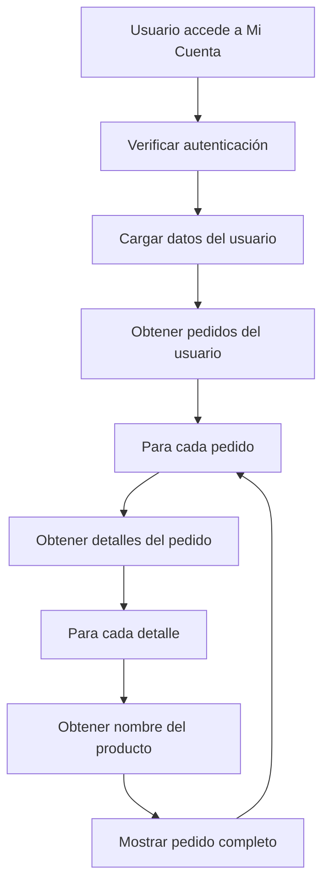

# Sistema de Historial de Pedidos

## Descripción
Este sistema permite a los usuarios ver su historial completo de compras desde su cuenta personal, mostrando todos los pedidos realizados con sus detalles de productos, cantidades y precios.

## Componentes Implementados

### 1. Página de Cuenta del Usuario
**Archivo:** `app/cuenta/page.tsx`

La página de cuenta ahora incluye dos pestañas principales:
- **Información Personal**: Permite ver y editar los datos del usuario
- **Historial de Compras**: Muestra todos los pedidos realizados por el usuario

### 2. Estructura de Base de Datos

#### Tabla: `pedidos`
Almacena la información principal de cada pedido.

| Campo | Tipo | Descripción |
|-------|------|-------------|
| id | SERIAL | ID único del pedido |
| usuario_id | UUID | ID del usuario que realizó el pedido |
| fecha | TIMESTAMP | Fecha y hora del pedido |
| total | DECIMAL(10,2) | Monto total del pedido |
| estado | VARCHAR(50) | Estado del pedido (pendiente, en_transito, completado) |
| created_at | TIMESTAMP | Fecha de creación del registro |
| updated_at | TIMESTAMP | Fecha de última actualización |

#### Tabla: `detalle_pedido`
Almacena los detalles de cada producto en un pedido.

| Campo | Tipo | Descripción |
|-------|------|-------------|
| id | SERIAL | ID único del detalle |
| pedido_id | INTEGER | ID del pedido (FK a pedidos) |
| producto_id | INTEGER | ID del producto (FK a productos) |
| cantidad | INTEGER | Cantidad del producto |
| subtotal | DECIMAL(10,2) | Subtotal del producto (cantidad × precio) |
| created_at | TIMESTAMP | Fecha de creación del registro |

### 3. Consultas Implementadas

#### Obtener Pedidos del Usuario
```typescript
const { data: pedidosData } = await supabase
  .from('pedidos')
  .select('id, fecha, total, estado')
  .eq('usuario_id', userId)
  .order('fecha', { ascending: false });
```

#### Obtener Detalles de un Pedido
```typescript
const { data: detallesData } = await supabase
  .from('detalle_pedido')
  .select('id, producto_id, cantidad, subtotal')
  .eq('pedido_id', pedidoId);
```

#### Obtener Nombre del Producto
```typescript
const { data: productoData } = await supabase
  .from('productos')
  .select('nombre')
  .eq('id', productoId)
  .single();
```

## Flujo de Funcionamiento



## Características del Historial de Compras

### Visualización de Pedidos Premium
- ✅ **Número de pedido** con diseño destacado
- ✅ **Fecha completa** con hora y minuto para mayor precisión
- ✅ **Total del pedido** en dólares ($) con badge verde compacto
- ✅ **Formato inteligente de precios**: Sin ceros decimales innecesarios
- ✅ **Estados visuales mejorados** con iconos y colores:
  - ✅ **Completado**: Badge verde con checkmark
  - 🚚 **En tránsito**: Badge azul con icono de camión
  - ⏳ **Pendiente**: Badge amarillo con icono de reloj
  - ⚪ **Otros estados**: Badge gris elegante
- ✅ **Iconografía moderna**: Shopping bag, calendario, y otros iconos representativos
- ✅ **Efectos visuales**: Sombras, gradientes, transiciones hover

### Detalles de Productos Avanzados
- ✅ **Cards individuales** para cada producto con efectos hover
- ✅ **Numeración automática** de productos (1, 2, 3...)
- ✅ **Nombre del producto** con tipografía mejorada
- ✅ **Cantidad** en badge azul elegante
- ✅ **Subtotal** en dólares con formato inteligente (sin .00 innecesarios)
- ✅ **Precio unitario** cuando hay múltiples cantidades
- ✅ **Separadores visuales** entre productos
- ✅ **Transiciones suaves** al pasar el mouse
- ✅ **Diseño responsive** que se adapta a diferentes pantallas

### Estado Vacío
- ✅ Mensaje informativo cuando no hay pedidos
- ✅ Icono visual representativo
- ✅ Sugerencia para realizar la primera compra

## Configuración de Base de Datos

### Paso 1: Ejecutar Script SQL
Ejecuta el archivo `database_pedidos.sql` en el SQL Editor de Supabase para crear las tablas necesarias.

### Paso 2: Verificar Políticas RLS
Las políticas de Row Level Security (RLS) están configuradas para:
- Los usuarios solo pueden ver sus propios pedidos
- Los usuarios solo pueden crear pedidos asociados a su cuenta
- Los administradores pueden ver y actualizar todos los pedidos

### Paso 3: Verificar Foreign Keys
Asegúrate de que existen las siguientes relaciones:
- `pedidos.usuario_id` → `usuarios.id`
- `detalle_pedido.pedido_id` → `pedidos.id`
- `detalle_pedido.producto_id` → `productos.id`

## Estados de Pedido

| Estado | Descripción | Color | Icono | Filtro | Dropdown |
|--------|-------------|-------|-------|--------|----------|
| todos | Ver todos los pedidos | Gris | 📋 | Todos | - |
| pendiente | Pedido recibido, esperando procesamiento | Amarillo | ⏳ | Pendientes | Pendiente |
| pagado | Pedido confirmado y pagado | Azul | 💳 | Pagados | Pagado |
| enviado | Pedido en camino al cliente | Púrpura | 📦 | Enviados | Enviado |
| entregado | Pedido entregado exitosamente | Verde | ✅ | Entregados | Entregado |

## Configuración de Moneda

### Cambio de € a $ con Formato Inteligente
El sistema ahora utiliza **dólares estadounidenses ($)** con formato inteligente que elimina los ceros decimales cuando no son necesarios:

**Función Helper:**
```typescript
const formatPrice = (price: number): string => {
  const formatted = price.toFixed(2);
  return formatted.endsWith('.00') ? price.toFixed(0) : formatted;
};
```

**Antes:**
```typescript
<p className="font-semibold text-xl text-gray-900 mb-2">€{order.total.toFixed(2)}</p>
<span className="font-semibold text-gray-900">€{detalle.subtotal.toFixed(2)}</span>
```

**Después:**
```typescript
<p className="font-bold text-2xl text-[#196428] mb-2">${formatPrice(order.total)}</p>
<span className="font-bold text-[#196428] text-lg">${formatPrice(detalle.subtotal)}</span>
```

**Ejemplos de Formato:**
- `$89.99` → `$89.99` (mantiene decimales)
- `$90.00` → `$90` (elimina .00)
- `$45.50` → `$45.50` (mantiene decimales)

### Mejoras Visuales Implementadas

#### 1. Cards de Pedido Premium
- **Gradiente sutil** de fondo (blanco a verde claro)
- **Border izquierdo verde** con el color de la marca (#196428)
- **Badge de número de orden** con gradiente verde destacado (Orden #1, #2, #3...)
- **Numeración secuencial** que cambia según el filtro activo
- **Sombras elevadas** con efecto hover
- **Icono de Shopping Bag** en el header
- **Separador elegante** entre secciones

#### 2. Filtros de Estado Interactivos
- **Filtros visuales** con botones redondeados y colores diferenciados
- **Contadores en tiempo real** mostrando la cantidad de pedidos por estado
- **Filtro "Todos"** para ver todos los pedidos sin restricciones
- **Feedback visual** con colores activos/inactivos según el filtro seleccionado

#### 3. Header de Pedido Mejorado
- **Badge del total** ultra compacto en fondo verde con tipografía en blanco
- **Selector de estado** elegante con dropdown visual (⏳, 💳, 📦, ✅)
- **Fecha con hora completa** para mayor precisión
- **Layout responsive** que se adapta a móviles y desktop

#### 4. Selector de Estado
- **Dropdown visual** con iconos representativos para cada estado
- **Colores diferenciados** por estado (amarillo, azul, púrpura, verde)
- **Actualización en tiempo real** del estado en la base de datos
- **Feedback visual** inmediato del cambio de estado

#### 5. Numeración Secuencial de Órdenes
- **Badge de orden** con gradiente verde destacado (Orden #1, #2, #3...)
- **Numeración dinámica** que cambia según el filtro activo
- **Reinicio por categoría** para mejor organización visual
- **Diferenciación clara** entre Orden # y Pedido # (ID de BD)

#### 6. Detalles de Productos
- **Cards individuales** para cada producto
- **Numeración automática** (1, 2, 3...)
- **Efectos hover** con cambios de color
- **Precio unitario** mostrado cuando hay múltiples cantidades
- **Separadores visuales** entre productos

## Funcionalidades de Filtrado

### Sistema de Filtros Interactivos
El AdminDashboard incluye un sistema completo de filtros para organizar y visualizar los pedidos de manera eficiente:

#### Filtros Disponibles
- **📋 Todos**: Muestra todos los pedidos sin restricciones
- **⏳ Pendientes**: Solo pedidos esperando procesamiento
- **💳 Pagados**: Solo pedidos confirmados y pagados
- **📦 Enviados**: Solo pedidos en camino al cliente
- **✅ Entregados**: Solo pedidos completados exitosamente

#### Características del Sistema de Filtros
- **Contadores en tiempo real**: Cada filtro muestra la cantidad de pedidos en ese estado
- **Feedback visual**: El filtro activo se resalta con el color de la marca
- **Actualización automática**: Los contadores se actualizan cuando cambian los estados
- **Estado vacío inteligente**: Mensaje específico cuando no hay pedidos en el filtro seleccionado

### Numeración Secuencial de Órdenes

#### ¿Cómo Funciona?
El sistema enumera los **pedidos completos** de manera secuencial dentro de cada categoría/filtro:

**Ejemplo:**
```
📋 Todos (5 órdenes)
  ├── Orden #1 - Pedido #1023
  ├── Orden #2 - Pedido #1024
  ├── Orden #3 - Pedido #1025
  ├── Orden #4 - Pedido #1026
  └── Orden #5 - Pedido #1027

⏳ Pendientes (2 órdenes)
  ├── Orden #1 - Pedido #1023
  └── Orden #2 - Pedido #1025

💳 Pagados (2 órdenes)
  ├── Orden #1 - Pedido #1024
  └── Orden #2 - Pedido #1027

✅ Entregados (1 orden)
  └── Orden #1 - Pedido #1026
```

#### Características
- **Numeración dinámica**: El número de orden cambia según el filtro activo
- **Reinicio por categoría**: Cada filtro comienza desde #1
- **Badge visual destacado**: Con gradiente verde y sombra
- **Orden vs Pedido ID**:
  - **Orden #**: Número secuencial en la categoría actual (1, 2, 3...)
  - **Pedido #**: ID único de la base de datos (1023, 1024, 1025...)

#### Implementación
```typescript
// Mapeo con índice de orden de pedidos
.map(([pedidoId, pedido]: [string, any], ordenIndex: number) => (
  <Card key={pedidoId}>
    {/* Badge de Número de Orden */}
    <div className="bg-gradient-to-br from-[#196428] to-[#145020] text-white px-4 py-2 rounded-lg shadow-lg">
      <div className="text-xs font-medium text-green-100">Orden</div>
      <div className="text-2xl font-black">#{ordenIndex + 1}</div>
    </div>

    {/* Pedido ID de la base de datos */}
    <h3 className="text-2xl font-bold">Pedido #{pedido.pedido_id}</h3>
  </Card>
))
```

#### Implementación Técnica
```typescript
// Filtro de estado
const [filtroEstado, setFiltroEstado] = useState<string>('todos');

// Función para filtrar pedidos
const getPedidosFiltrados = () => {
  if (filtroEstado === 'todos') {
    return pedidos;
  }
  return pedidos.filter(pedido => pedido.estado_pedido === filtroEstado);
};

// Función para obtener contadores
const getContadorPorEstado = (estado: string) => {
  return pedidos.filter(pedido => pedido.estado_pedido === estado).length;
};
```

## Interfaz de Usuario

### Diseño Responsive
- ✅ Adaptable a dispositivos móviles
- ✅ Grid responsive para información del pedido
- ✅ Tarjetas con diseño limpio y profesional

### Accesibilidad
- ✅ Iconos descriptivos (Calendar, ShoppingBag)
- ✅ Contraste de colores adecuado
- ✅ Textos legibles y bien estructurados

### Experiencia de Usuario
- ✅ Carga con indicador de loading
- ✅ Mensajes de error claros en consola
- ✅ Organización por pestañas (Tabs)
- ✅ Navegación intuitiva

## Mantenimiento y Actualizaciones

### Actualizar Estado de Pedido
Los administradores pueden actualizar el estado de los pedidos desde el panel de administración:

```typescript
await supabase
  .from('pedidos')
  .update({ estado: 'completado' })
  .eq('id', pedidoId);
```

### Monitorear Pedidos
Para ver todos los pedidos en la base de datos:

```sql
SELECT 
  p.id,
  u.nombre as cliente,
  p.fecha,
  p.total,
  p.estado,
  COUNT(dp.id) as cantidad_items
FROM pedidos p
LEFT JOIN usuarios u ON u.id = p.usuario_id
LEFT JOIN detalle_pedido dp ON dp.pedido_id = p.id
GROUP BY p.id, u.nombre, p.fecha, p.total, p.estado
ORDER BY p.fecha DESC;
```

## Mejoras Futuras Sugeridas

1. **Filtros de Búsqueda**
   - Filtrar por rango de fechas
   - Filtrar por estado
   - Buscar por número de pedido

2. **Exportación de Datos**
   - Descargar historial en PDF
   - Exportar a Excel/CSV

3. **Seguimiento de Envío**
   - Número de rastreo
   - Mapa de seguimiento en tiempo real

4. **Notificaciones**
   - Notificar cambios de estado
   - Recordatorios de entrega

5. **Reordenar**
   - Botón para volver a pedir productos del historial
   - Agregar al carrito directamente desde el historial

6. **Valoraciones**
   - Permitir calificar productos comprados
   - Dejar reseñas

## Soporte

Para reportar problemas o sugerir mejoras, contacta al equipo de desarrollo.

## Changelog

### Versión 1.2.0 (Actual)
- ✅ **Sistema de Filtros Interactivos**: Filtros por estado con contadores en tiempo real
- ✅ **Numeración Secuencial de Órdenes**: Badge destacado con numeración dinámica por categoría
- ✅ **Diseño Premium de Cards**: Cards modernas con gradientes, sombras y efectos hover
- ✅ **Moneda en Dólares**: Cambiado de € a $ en toda la interfaz
- ✅ **Formato Inteligente de Precios**: Elimina ceros decimales innecesarios (.00)
- ✅ **Badge del Total Ultra Compacto**: Diseño aún más pequeño y elegante para el precio total
- ✅ **Selector de Estado Dropdown**: Reemplaza botones con elegante dropdown visual
- ✅ **Formato Inteligente en AdminDashboard**: Aplicado a todos los precios del panel de administración
- ✅ **Información Visual Enriquecida**:
  - Iconos representativos para cada elemento
  - Badges con estados mejorados (✓ Completado, 🚚 En tránsito, ⏳ Pendiente)
  - Total del pedido en badge verde ultra compacto y elegante
  - Selector de estado visual con dropdown intuitivo
  - Filtros interactivos con contadores en tiempo real
  - Numeración secuencial de órdenes con badges destacados
  - Fecha con hora completa para mayor precisión
- ✅ **Detalles de Productos Avanzados**:
  - Cards individuales para cada producto con efectos hover
  - Numeración automática de productos
  - Precio unitario cuando hay múltiples cantidades
  - Separadores visuales elegantes
- ✅ **UI/UX Mejorada**:
  - Transiciones suaves y efectos hover
  - Layout responsive optimizado
  - Colores consistentes con la marca
  - Tipografía mejorada y jerarquía visual clara
- ✅ Integración completa con Supabase
- ✅ Sistema de estados de pedido robusto
- ✅ Políticas de seguridad RLS implementadas

### Versión 1.0.0
- ✅ Implementación inicial del historial de pedidos
- ✅ Integración con Supabase
- ✅ Interfaz de usuario responsive
- ✅ Sistema de estados de pedido
- ✅ Políticas de seguridad RLS

